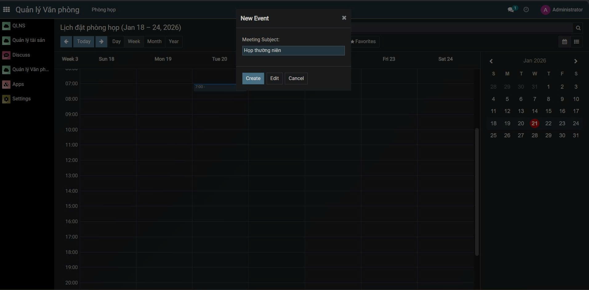
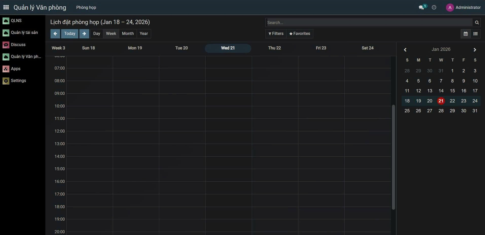
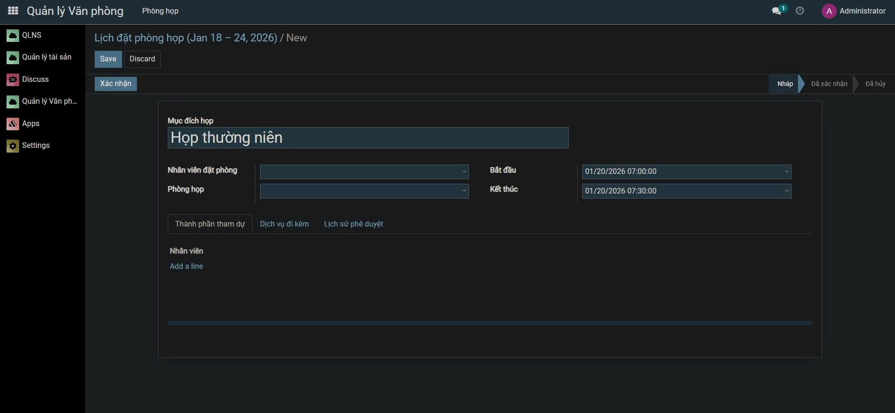
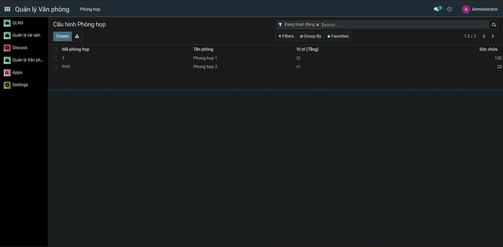
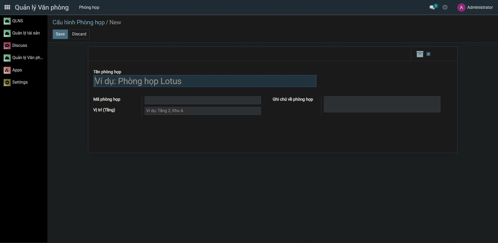
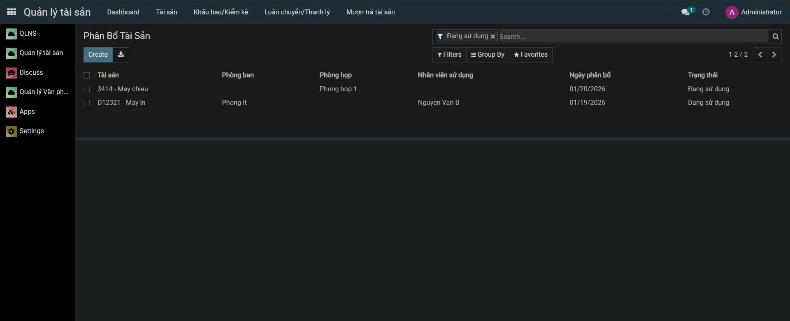
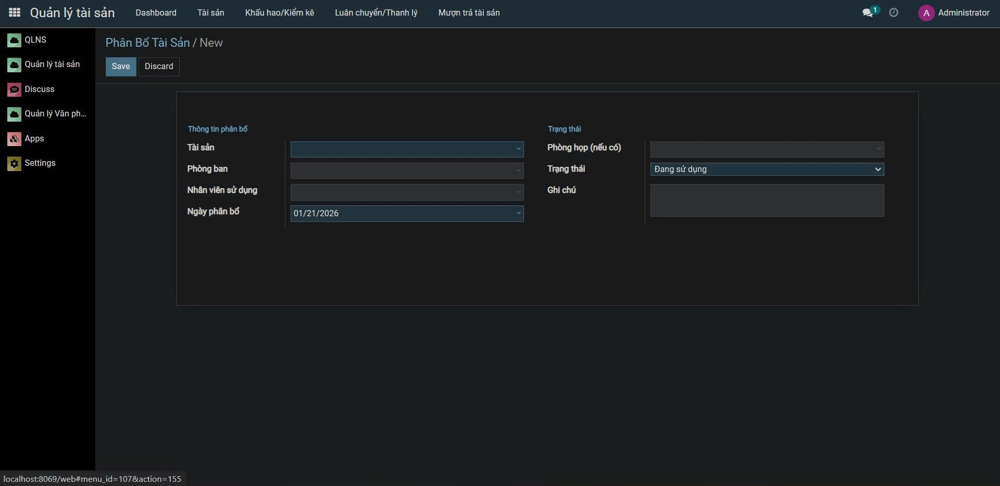

<h2 align="center">
    <a href="https://dainam.edu.vn/vi/khoa-cong-nghe-thong-tin">
    🎓 Faculty of Information Technology (DaiNam University)
    </a>
</h2>
<h2 align="center">
    Youth Union Member Management
</h2>
<div align="center">
    <p align="center">
        
        
        
    </p>

[](https://www.facebook.com/DNUAIoTLab)
[](https://dainam.edu.vn/vi/khoa-cong-nghe-thong-tin)
[](https://dainam.edu.vn)

</div>

 ## 📖 1. Giới thiệu
 Hệ thống Quản lý Tài sản và Điều phối Phòng họp được xây dựng nhằm hỗ trợ công tác quản lý, theo dõi và sử dụng hiệu quả các tài sản dùng chung và phòng họp trong doanh nghiệp. Thay vì quản lý thủ công bằng sổ sách hoặc các tệp Excel rời rạc, hệ thống mang đến một giải pháp tập trung, hiện đại và dễ sử dụng, giúp hạn chế trùng lịch, thất thoát tài sản và nâng cao hiệu quả vận hành.

## 🔧 2. Các công nghệ được sử dụng

<p align="center">
  
  
  
  
</p>

<p align="center">
  
  
</p>


  ## 🚀 3. Hình ảnh các chức năng

  ### 🔧 Chức năng đặt phòng và quản lý lịch đặt phòng họp
<p>
  
  
  
</p>

 ### 🔧 Chức năng quản lý phòng họp
<p>
  
  
</p>

### 🔧 Chức năng phân bổ tài sản
<p>
  
  
</p>

## ⚙️ 4. Cài đặt công cụ, môi trường và các thư viện cần thiết

## 4.1. Clone project.

```
git clone https://github.com/THLHitman/TTDN-16-06-N7.git
git checkout 
```

## 4.2. cài đặt các thư viện cần thiết

Người sử dụng thực thi các lệnh sau đề cài đặt các thư viện cần thiết

```
sudo apt-get install libxml2-dev libxslt-dev libldap2-dev libsasl2-dev libssl-dev python3.10-distutils python3.10-dev build-essential libssl-dev libffi-dev zlib1g-dev python3.10-venv libpq-dev
```
## 4.3. khởi tạo môi trường ảo.

Thay đổi trình thông dịch sang môi trường ảo và chạy requirements.txt để cài đặt tiếp các thư viện được yêu cầu
```
python3.10 -m venv ./venv
```
```
source venv/bin/activate
```
```
pip3 install -r requirements.txt
```

# 5. Setup database

Khởi tạo database trên docker bằng việc thực thi file dockercompose.yml.
```
sudo apt install docker-compose
```
```
sudo docker-compose up -d
```

# 6. Setup tham số chạy cho hệ thống

## 6.1. Khởi tạo odoo.conf

Tạo tệp **odoo.conf** có nội dung như sau:

```
[options]
addons_path = addons
db_host = localhost
db_password = odoo
db_user = odoo
db_port = 5434
xmlrpc_port = 8069
```

# 7. Chạy hệ thống và cài đặt các ứng dụng cần thiết

Lệnh chạy
```
python3 odoo-bin.py -c odoo.conf -u all
```


Người sử dụng truy cập theo đường dẫn _http://localhost:8069/_ để đăng nhập vào hệ thống.

Hoàn tất
    